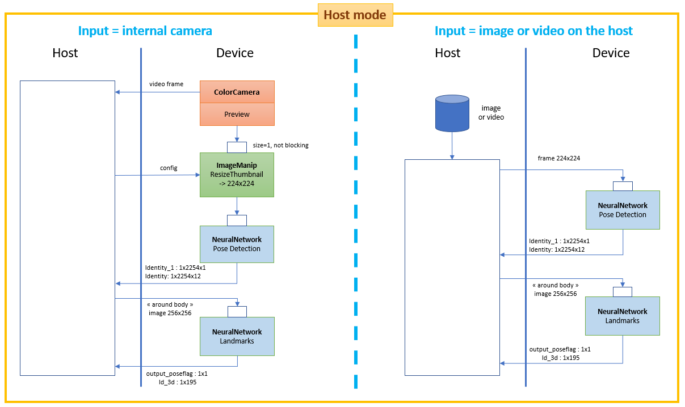
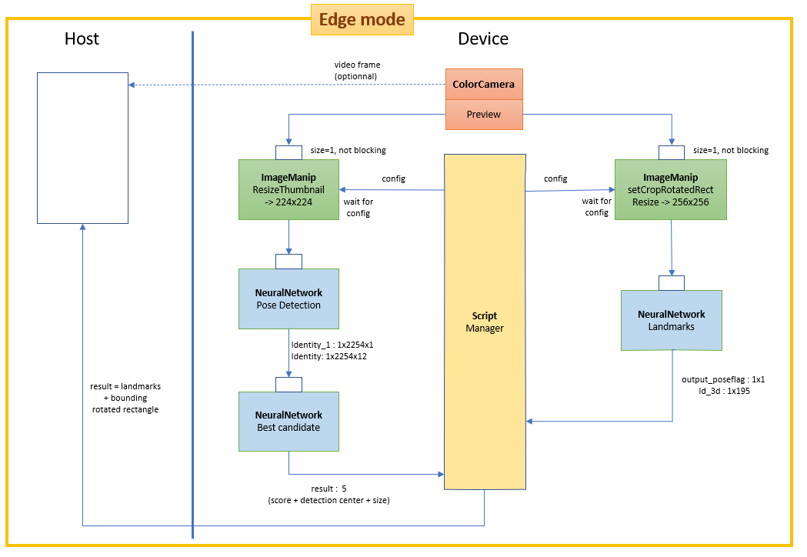

# Blazepose tracking with DepthAI

Running Google Mediapipe single body pose tracking models on [DepthAI](https://docs.luxonis.com/en/gen2/) hardware (OAK-1, OAK-D, ...). 

The Blazepose landmark models available in this repository are :
- the version "full" and "lite" of mediapipe 0.8.4 (2021/05) ("heavy" is unusable on MYRIADX),
- the older full body model from mediapipe 0.8.3.1, as it offers an intermediate inference speed between the new "full" and "lite" models.

The pose detection model comes from mediapipe 0.8.4 and is compatible with the 3 landmark models.


For the competitor Movenet on DepthAI, please visit : [depthai_movenet](https://github.com/geaxgx/depthai_movenet)

For an OpenVINO version of Blazepose, please visit : [openvino_blazepose](https://github.com/geaxgx/openvino_blazepose)


## Architecture: Host mode vs Edge mode
Two modes are available:
- **Host mode :** aside the neural networks that run on the device, almost all the processing is run on the host (the only processing done on the device is the letterboxing operation before the pose detection network when using the device camera as video source). **Use this mode when you want to infer on external input source (videos, images).**
- **Edge mode :** most of the processing (neural networks, post-processings, image manipulations, ) is run on the device thaks to the depthai scripting node feature. It works only with the device camera but is **definitely the best option when working with the internal camera** (faster than in Host mode). The data exchanged between the host and the device is minimal: the landmarks of detected body (~2kB/frame), and optionally the device video frame.

|Landmark model (Edge mode)|FPS|
|-|-|
|Full|14|
|Lite|27|
|831 (mediapipe 0.8.3.1)|18|
<br>




*Note : the Edge mode schema is missing a custom NeuralNetwork node between the ImageManip node on the right and the landmark NeuralNetwork. This custom NeuralNetwork runs a very simple model that normalize (divide by 255) the output image from the ImageManip node. This is a temporary fix, should be removed when depthai ImageManip node will support setFrameType(RGBF16F16F16p).*

## Install

**Currently, the scripting node capabilty is an alpha release. It is important to use the version specified in the requirements.txt**

Install the python packages DepthAI, Opencv, open3d with the following command:

```python3 -m pip install -r requirements.txt```

## Run

**Usage:**

```
> python demo.py -h
usage: demo.py [-h] [-e] [-i INPUT] [--pd_m PD_M] [--lm_m LM_M] [-c]
               [--no_smoothing] [--filter_window_size FILTER_WINDOW_SIZE]
               [--filter_velocity_scale FILTER_VELOCITY_SCALE]
               [-f INTERNAL_FPS]
               [--internal_frame_height INTERNAL_FRAME_HEIGHT] [-s] [-t]
               [--force_detection] [-3] [-o OUTPUT]

optional arguments:
  -h, --help            show this help message and exit
  -e, --edge            Use Edge mode (postprocessing runs on the device)
  -i INPUT, --input INPUT
                        'rgb' or 'rgb_laconic' or path to video/image file to
                        use as input (default=rgb)
  --pd_m PD_M           Path to an .blob file for pose detection model
  --lm_m LM_M           Landmark model ('full' or 'lite' or '831') or path to
                        an .blob file (default=None)
  -c, --crop            Center crop frames to a square shape before feeding
                        pose detection model
  --no_smoothing        Disable smoothing filter
  --filter_window_size FILTER_WINDOW_SIZE
                        Smoothing filter window size. Higher value adds to lag
                        and to stability (default=5)
  --filter_velocity_scale FILTER_VELOCITY_SCALE
                        Smoothing filter velocity scale. Lower value adds to
                        lag and to stability (default=10)
  -f INTERNAL_FPS, --internal_fps INTERNAL_FPS
                        Fps of internal color camera. Too high value lower NN
                        fps (default= depends on the model)
  --internal_frame_height INTERNAL_FRAME_HEIGHT
                        Internal color camera frame height in pixels
                        (default=640)
  -s, --stats           Print some statistics at exit
  -t, --trace           Print some debug messages
  --force_detection     Force person detection on every frame (never use
                        landmarks from previous frame to determine ROI)
  -3, --show_3d         Display skeleton in 3d in a separate window (valid
                        only for full body landmark model)
  -o OUTPUT, --output OUTPUT
                        Path to output video file
```
**Examples :**

- To use default internal color camera as input with the model "full" in Host mode:

    ```python3 demo.py```

- To use default internal color camera as input with the model "full" in Edge mode:

    ```python3 demo.py -e```

- To use a file (video or image) as input :

    ```python3 demo.py -i filename```

- To use the model "lite" :

    ```python3 demo.py -lm_m lite```

- To show the skeleton in 3D (note that it will lower the FPS):

    ```python3 demo.py -3```

- When using the internal camera, to change its FPS to 15 : 

    ```python3 demo.py --internal_fps 15```

    Note: by default, the default internal camera FPS depends on the model. These default values are based on my own observations. **Please, don't hesitate to play with this parameter to find the optimal value.** If you observe that your FPS is well below the default value, you should lower the FPS with this option until the set FPS is just above the observed FPS.

- When using the internal camera, you probably don't need to work with the full resolution. You can set a lower resolution (and win a bit of FPS) by using this option: 

    ```python3 demo.py --internal_frame_size 450```

    Note: currently, depthai supports only some possible values for this argument. The value you specify will be replaced by the closest possible value (here 432 instead of 450).

- By default, a temporal filter smoothes the landmark positions. You can tune the smoothing with the arguments *--filter_window_size* and *--filter_velocity_scale*. Use *--no_smoothing* to disable the filter.

|Keypress|Function|
|-|-|
|*Esc*|Exit|
|*space*|Pause|
|r|Show/hide the bounding rotated rectangle around the body|
|f|Show/hide FPS|


## Mediapipe models 
You can directly find the model files (.xml and .bin) under the 'models' directory. Below I describe how to get the files in case you need to regenerate the models.

1) Clone this github repository in a local directory (DEST_DIR)
2) In DEST_DIR/models directory, download the tflite models from [this archive](https://drive.google.com/file/d/1CY1-ZsAFvbKk1-Kh2wgiECaBEtHcFE0Q/view?usp=sharing). The archive contains:
    * Pose detection model from Mediapipe 0.8.4, 
    * Full pose landmark modelfrom Mediapipe 0.8.4,
    * Lite body pose landmark model from Mediapipe 0.8.4,
    * Full body landmark model from Mediapipe 0.8.3.1.

Note that Mediapipe is also publishing an "Heavy" version of the model but [this version, after conversion, in FP16 is unusable on MYRIADX](https://github.com/PINTO0309/tflite2tensorflow/issues/9).

3) Install the amazing [PINTO's tflite2tensorflow tool](https://github.com/PINTO0309/tflite2tensorflow). Use the docker installation which includes many packages including a recent version of Openvino.
3) From DEST_DIR, run the tflite2tensorflow container:  ```./docker_tflite2tensorflow.sh```
4) From the running container: 
```
cd workdir/models
./convert_models.sh
```
The *convert_models.sh* converts the tflite models in tensorflow (.pb), then converts the pb file into Openvino IR format (.xml and .bin), and finally converts the IR files in MyriadX format (.blob).

5) By default, the number of SHAVES associated with the blob files is 4. In case you want to generate new blobs with different number of shaves, you can use the script *gen_blob_shave.sh*:
```
# Example: to generate blobs for 6 shaves
./gen_blob_shave.sh -m pd -n 6        # will generate pose_detection_sh6.blob
./gen_blob_shave.sh -m full -n 6   # will generate pose_landmark_full_sh6.blob
```

**Explanation about the Model Optimizer params :**
- The preview of the OAK-* color camera outputs BGR [0, 255] frames . The original tflite pose detection model is expecting RGB [-1, 1] frames. ```--reverse_input_channels``` converts BGR to RGB. ```--mean_values [127.5,127.5,127.5] --scale_values [127.5,127.5,127.5]``` normalizes the frames between [-1, 1].
- The original landmark model is expecting RGB [0, 1] frames. Therefore, the following arguments are used ```--reverse_input_channels```, but unlike the detection model, we choose to do the normalization in the python code and not in the models (via ```--scale_values```). Indeed, we have observed a better accuracy with FP16 models when doing the normalization of the inputs outside of the models ([a possible explanation](https://github.com/PINTO0309/tflite2tensorflow/issues/9#issuecomment-842460014)).

## Custom models

The `custom_models` directory contains the code to build the following custom models:
- DetectionBestCandidate: this model processes the outputs of the pose detection network (a 1x2254x1 tensor for the scores and a 1x2254x12 for the regressors) and yields the regressor with the highest score.
- DivideBy255: this model transforms an 256x256 RGB888p ([0, 255]) image to a 256x256 RGBF16F16F16p image ([0., 1.]).

The method used to build these models is well explained on the [rahulrav's blog](https://rahulrav.com/blog/depthai_camera.html).


## Code

To facilitate reusability, the code is splitted in 2 classes:
-  **BlazeposeDepthai**, which is responsible of computing the body landmarks. The importation of this class depends on the mode:
```
# For Host mode:
from BlazeposeDepthai import BlazeposeDepthai
```
```
# For Edge mode:
from BlazeposeDepthaiEdge import BlazeposeDepthai
```
- **BlazeposeRenderer**, which is responsible of rendering the landmarks and the skeleton on the video frame. 

This way, you can replace the renderer from this repository and write and personalize your own renderer (for some projects, you may not even need a renderer).

The file ```demo.py``` is a representative example of how to use these classes:
```
from BlazeposeDepthaiEdge import BlazeposeDepthai
from BlazeposeRenderer import BlazeposeRenderer

# The argparse stuff has been removed to keep only the important code

pose = BlazeposeDepthai(input_src=args.input, 
            pd_model=args.pd_m,
            lm_model=args.lm_m,
            smoothing=not args.no_smoothing,
            filter_window_size=args.filter_window_size,
            filter_velocity_scale=args.filter_velocity_scale,                
            crop=args.crop,
            internal_fps=args.internal_fps,
            internal_frame_height=args.internal_frame_height,
            force_detection=args.force_detection,
            stats=args.stats,
            trace=args.trace)   

renderer = BlazeposeRenderer(
                pose, 
                show_3d=args.show_3d, 
                output=args.output)

while True:
    # Run blazepose on next frame
    frame, body = pose.next_frame()
    if frame is None: break
    # Draw 2d skeleton
    frame = renderer.draw(frame, body)
    key = renderer.waitKey(delay=1)
    if key == 27 or key == ord('q'):
        break
renderer.exit()
pose.exit()
```


## Examples

|||
|-|-|
|[Semaphore alphabet](examples/semaphore_alphabet)  ||

## Credits
* [Google Mediapipe](https://github.com/google/mediapipe)
* Katsuya Hyodo a.k.a [Pinto](https://github.com/PINTO0309), the Wizard of Model Conversion !
* [Tai Chi Step by Step For Beginners Training Session 4](https://www.youtube.com/watch?v=oawZ_7wNWrU&ab_channel=MasterSongKungFu)
* [Semaphore with The RCR Museum](https://www.youtube.com/watch?v=DezaTjQYPh0&ab_channel=TheRoyalCanadianRegimentMuseum)